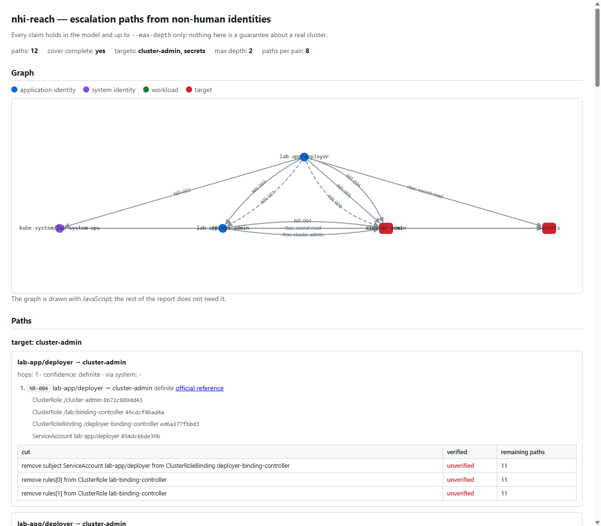

# nhi-reach

> How far can this non-human identity get?

`nhi-reach` is a defensive, read-only CLI tool that audits non-human identities (NHI) in Kubernetes/OpenShift. It analyzes ServiceAccounts, their tokens and their RBAC/SCC bindings, and computes which **privilege escalation paths** exist from each identity toward three critical targets:

1. Privileges equivalent to `cluster-admin`.
2. Control of a node (privileged workloads, `hostPath`, permissive SCCs).
3. Read access to Secrets in sensitive namespaces.

Of these, `cluster-admin` and `secrets` are evaluated today; `node` is accepted and reported as a gap until the workload-effect representation exists.

<p align="center">
  <a href="examples/lab/demo.gif"></a>
  <br>
  <sub>The <code>table</code> report against a disposable lab cluster with deliberately misconfigured RBAC. The <a href="examples/lab/demo.tape">recording script</a> reproduces it byte for byte; every route in it is synthetic. Click to open full size.</sub>
</p>

**Status (2026-10-08, v0.1.0): the analysis engine and the output surface are complete, and the light version runs end to end online and offline.** `nhi-reach analyze --from DIR -o table|json|html` reads an offline snapshot, resolves the effective permissions of every ServiceAccount (implicit groups, `resourceNames`, materialized aggregated ClusterRoles) and enumerates the escalation paths to the `cluster-admin` and `secrets` targets, chaining the direct binding and the six hops of the approved catalog (NR-001…NR-006). The table report, the versioned JSON schema v1 (`schema_version: 1`) and a **self-contained HTML report** (a single file, no network requests, with the graph embedded) are written with `--out`; per-path cuts are verified in the model and bottlenecks are proposed as a verified cover. **Live mode is available**: `nhi-reach snapshot -o DIR` captures a cluster and `nhi-reach analyze --live` analyzes it directly, always read-only (only `get`/`list`, enforced in the HTTP transport, not just in the docs). The `node` target is not evaluated: it is accepted and reported as a `gap` until the workload-effect representation exists.

<p align="center">
  <a href="docs/img/report-html.png"></a>
  <br>
  <sub>The self-contained HTML report: the route graph, the paths with their evidence, and each cut with its verification state. Generated offline from the synthetic lab snapshot; no cluster is contacted.</sub>
</p>

## Positioning

| Tool | What it does | Difference with nhi-reach |
|---|---|---|
| [nhi-watch](https://github.com/Zyrakk/nhi-watch) | NHI inventory, per-identity scoring, CIS, drift, inactivity, minimum RBAC by use | Evaluates each identity in isolation and does not chain permissions. **Complementary**: nhi-reach could consume its JSON later |
| [KubeHound](https://github.com/DataDog/KubeHound) (Datadog) | Attack-path graph in K8s | Its README lists Docker and Docker Compose V2 as requirements and documents Gremlin queries (TinkerPop); it also offers a service mode (KHaaS). nhi-reach is a single offline binary, NHI-focused, with cuts verified in the model. Its [homepage](https://kubehound.io/) and [attacks index](https://kubehound.io/reference/attacks/), checked 2026-10-07, show no mentions of OpenShift SCCs |
| KubiScan / rbac-tool | Risky permissions / RBAC visualization | They do not compute escalation chains |

Status of these tools checked 2026-10-07 through the GitHub API: [KubeHound](https://github.com/DataDog/KubeHound), last push 2026-09-30; [rbac-police](https://github.com/PaloAltoNetworks/rbac-police), archived; [KubiScan](https://github.com/cyberark/KubiScan) and [rbac-tool](https://github.com/alcideio/rbac-tool), no pushes since 2025; [nhi-watch](https://github.com/Zyrakk/nhi-watch), last push 2026-03-16.

## Principles

- **Read-only**, always: it never creates, modifies or executes anything in the cluster. The live mode issues only `get`/`list`, enforced in the HTTP transport.
- **Offline first**: it analyzes exported snapshots, and the live mode reads the cluster through the same read-only client.
- **Deterministic**: same snapshot → same output, byte for byte (table, JSON and HTML, with golden files compared byte for byte).
- **Evidence-first**: every edge carries references to the objects that enable it, with their SHA-256 hash ([evidence rules](docs/evidence.md)).
- **Never stores Secret values**: only metadata, `type` and the key names of `data`/`stringData` ([evidence rules](docs/evidence.md)).

## Installing

Precompiled binaries for Linux, macOS and Windows (amd64 and arm64), a `go
install` route and a distroless, non-root container image are all documented in
[installing nhi-reach](docs/install.md). The short version:

```sh
go install github.com/d4rpell/nhi-reach/cmd/nhi-reach@v0.1.0     # Go 1.25+
docker run --rm ghcr.io/d4rpell/nhi-reach:0.1.0 analyze --help
```

## Usage

```bash
go run ./cmd/nhi-reach analyze --from testdata/light/hit
go run ./cmd/nhi-reach analyze --from testdata/light/hit -o json --out report.json
go run ./cmd/nhi-reach analyze --from testdata/light/hit -o html --out report.html

# Live mode (read-only: get/list only, enforced in code)
go run ./cmd/nhi-reach snapshot -o snapshot-dir
go run ./cmd/nhi-reach analyze --live -o table
```

`nhi-reach snapshot` lists the input types into a directory, refuses a directory that is not empty (so two captures are never mixed), writes the per-object `manifest.json` and a `metadata.json` with the tool version, date, context and per-file hashes, and then verifies what it wrote. Secret values are never written to disk; see [permissions](docs/permissions.md) for the minimal ClusterRole the live mode needs.

The table prints one row per path (origin, target, hop count, confidence, whether the route crosses a system identity, and the best cut with its verification state), grouped by target, with routes born at system identities in a separate block, followed by the analysis `gaps`. The JSON is the versioned v1 schema (`schema_version: 1`). The HTML is a single self-contained file: it opens with no network (the graph library is embedded, no CDN, no requests), draws the route graph with system identities, application identities and targets styled apart, and shows per path the hops, the evidence, the link to the official catalog reference, the cuts with their verification state and the bottlenecks; the content is rendered in Go and stays readable without JavaScript (only the graph is missing).

The repository fixtures are synthetic: `testdata/light/hit` has expected paths, `testdata/light/miss` has none, and `testdata/light/secrets` exercises the `secrets` target. The input format is the JSON of `kubectl get <resource> -o json`, a list, or a single object per file.

Every analysis flag is wired: `--from`, `--live` (with `--kubeconfig` and `--context`), `-o table|json|html`, `--out`, `--max-depth`, `--paths-per-pair`, `--from-identity`, `--target cluster-admin|node|secrets` (repeatable; defaults to all three), `--sensitive-ns` (extends the default list), `--system-ns`, `--include-system` and `--fail-on none|any`. `--live` and `--from DIR` are mutually exclusive. `--target node` is accepted and reported as a `gap`. Exit codes: 0 complete analysis, 1 unclassified error (including `--out` I/O and a failed snapshot verification), 2 `--fail-on any` with findings, 3 input error. With `go run`, `go` reports the code as `exit status N` and returns 1, while the binary returns the real code.

Every hop of the catalog cites the official Kubernetes/OpenShift documentation that justifies it (`nhi-reach rules` prints the catalog with its references).

## Building

Go 1.25 is the minimum declared in `go.mod`; the `toolchain go1.25.13` directive pins the build toolchain to a release whose standard library and dependencies have the fixes the tool needs (the `html/template` fixes the HTML report needs, and the `x/net`/`x/text` fixes reachable once the live mode speaks HTTPS; none of them has a 1.23/1.24 backport). `make build` produces `bin/nhi-reach`; `make test`, `make vet`, `make lint` and `make vuln` run the checks CI runs.

## Documentation

- [Installing](docs/install.md): precompiled binaries, `go install` and the container image.
- [Evidence rules](docs/evidence.md): what the tool keeps from each resource and why Secret values can never reach a report.
- [Permissions](docs/permissions.md): the minimal ClusterRole the live mode needs and the read-only guarantee.
- [Third-party notices](THIRD_PARTY_NOTICES.md): the embedded graph library (cytoscape.js, MIT), its version, source and pinned digest.
- [Changelog](CHANGELOG.md): release history.
- Design decisions, the backlog and the design spec are kept in the project's private documentation and are not linked from here.

## Roadmap

- The `node` target, once the workload-effect representation is decided (needed also for the OpenShift SCC hop, NR-007).
- A `--verify-cuts` opt-in flag, so cut verification can be turned off on very large clusters (measured in the engine benchmark); verification is on by default today.
- Signing (cosign) and an SBOM for the release artifacts.

## License

[Apache-2.0](LICENSE).
